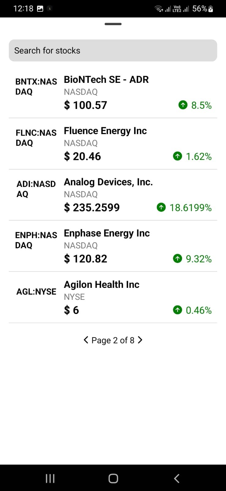
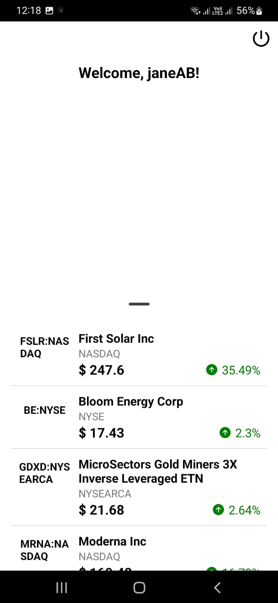
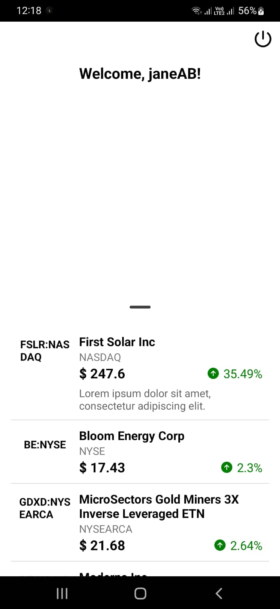
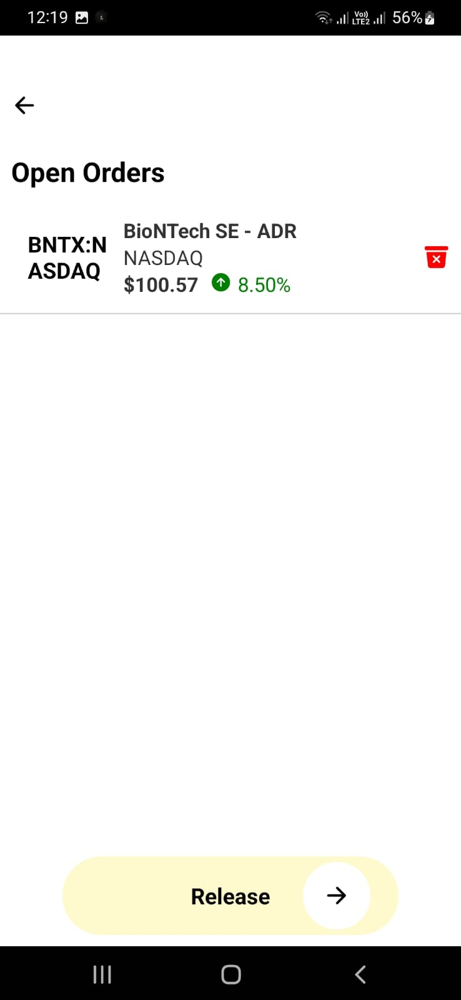
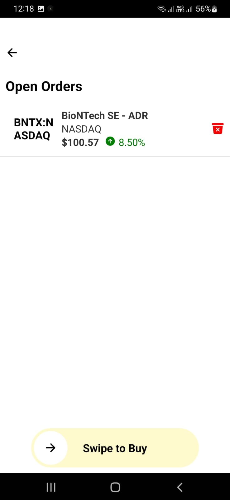
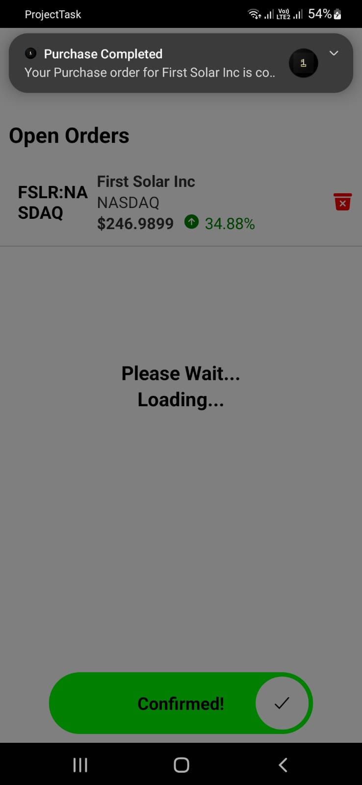

# Project Task

This project is a React Native application for managing stock orders. It includes features such as user authentication, fetching and searching stock data, and managing orders with swipe-to-confirm functionality.

## Table of Contents

- [Demo](#Demo)
- [Installation](#installation)
- [Usage](#usage)
- [Features](#features)
- [Components](#components)
- [APIs](#apis)
- [State Management](#state-management)
- [Notifications](#notifications)
- [Screens](#screens)
- [Contributing](#contributing)
- [License](#license)

## Demo

 





## Installation

1. Clone the repository:

   ```bash
   git clone https://github.com/prashant774/ProjectTask.git

   ```

2. Navigate to the project directory:
   cd ProjectTask

3. Install dependencies:
   npm install

4. Install CocoaPods dependencies (iOS only):
   cd ios && pod install

## Usage

1. Start the Metro bundler:
   npx react-native start

2. Run the application on Android:
   npx react-native run-android

3. Run the application on iOS:
   npx react-native run-ios

## Login Credentials

email: "user@example.com",
password: "password123",

email: "jane@example.com",
password: "password456",

email: "ab@1.com",
password: "123456",

## Features

User authentication
Fetching and displaying stock data
Searching stocks
Managing orders
Swipe-to-confirm functionality
Loader for async operations
Pagination

## Components

Loader
A component to display a loading spinner.

## SwipeButton

A component for swipe-to-confirm functionality.

## APIs

The project uses custom API functions to fetch and search stocks

## State Management

The project uses Redux for state management.

## Notifications

The project uses react-native-push-notification to handle local push notifications.

## Screens

# Splash Screen

Standard Splash Screen Behaviour

# Login Screen

Standard Login with email and password, use redux as global state management for login and logout

# Main Screen

Has a scrollable sheet which when scrolled up, will Reveal the search bar. This sheet will have all the Stocks with pagination, show 5 stocks on a single page and rest paginated. Each stock card should display -> Stock Name, Stock Ticker, Stock Full name, Stock Price, Price Change, Stock Image (Not in API figure a way to get it or use static) The API required for this is: Market Trend API-> Use “trend_type” = GAINER
On Swipe up, the search bar should be visible.

when the user has stopped typing hit the search API and get results. Search API -> Search Endpoint “query” = User input in Search Field

On Long pressing the stock card, show description of the stock
On Click of the stock card, open the stock detail page

# Stock Details Screen

In Stock Details page, there basic stock details and there is an option to add stock order, on adding it, user is taken to the Open Orders Page where there is a list of all the added stocks (Use Global State Management to manage the stock list)

# Orders Screen

In the Orders Page, There is a list of all the stocks added to the order list, users can remove a stock by clicking the delete button next to the stock. The Swipe to buy button, on swiping order is placed. On swipe complete send user a push notification with text: “Your Purchase order for {Stock Name} is completed” If multiple stocks in the same order, create multiple notifications.

## Contributing

1.  Fork the repository.
2.  Create a new branch.
3.  Make your changes.
4.  Submit a pull request.

## License

This project is licensed under the MIT License.
